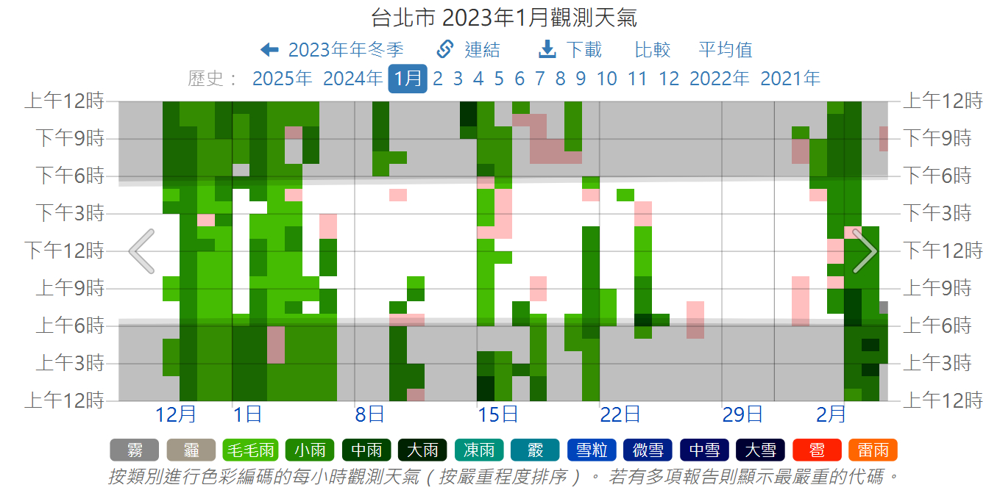

# 資料探勘工作分工

## 說明

本專案聚焦於 **[2023 年台北捷運全年度車站進出站人流統計資料](./CSV/2023_TRTS.csv)** ，並結合每日的 **天氣** 資訊，進行數據探勘與深度分析。  
以下為詳細的工作流程與負責人分工。

---

## 工作流程與分工

### 1. 捷運站分區整理  
**負責人**：木瓜丁  
**狀態**：❌ 未完成  

#### 任務說明：
- 將所有車站按區域或功能劃分為不同類別（如 A 類別、B 類別等）。
- 對同類別之車站，統計每日每時的 **進站人數** 與 **出站人數**。

---

### 2. 資料分時整理  
**負責人**：楊西瓜  
**狀態**：❌ 未完成

#### 任務說明：
- 按時段將整日數據劃分為三類別：**早**(05:00-10:00)、**中**(10:01-15:00)、**午**(15:01-20:00)、**晚**(20:01-01:00)。
- 基於車站分類，對以下維度進行統計：
  - **同車站類別**（例如 A 類車站）
  - **同日**（如 2023/01/01）
  - **同時段類別**（如「早」或「中」）
- 在以上條件下，統計出該時段內的 **進站人數** 與 **出站人數**。

---

### 3. 出/入人流整理  
**負責人**：香蕉法  
**狀態**：❌ 未完成  

#### 任務說明：
- 將 **出/入站人流量** 根據數值區間劃分為不同類別，例如：  
  - **少**：人流量較少  
  - **中**：人流量中等  
  - **多**：人流量高  
- 針對整理後的類別進行資料轉換（數值 -> 類別的轉換）。

---
### 4. 氣候資料建置  
**負責人**：江鳳梨 & 林暉恩  
**狀態**：❌ 未完成  
 2023天氣資訊-最新檔案 **[[檔案下載]](./CSV/2023天氣資訊.csv)**  
#### 任務說明：
- 根據 **[台北市2023年各日氣候資料圖](https://tw.weatherspark.com/h/m/137170/2023/1/%E5%8F%B0%E5%8C%97%E5%B8%82%E3%80%81%E5%8F%B0%E7%81%A32023%E5%B9%B41%E6%9C%88%E6%AD%B7%E5%8F%B2%E5%A4%A9%E6%B0%A3#Figures-ObservedWeather)** 提取日天氣圖表，並進行資料轉換，準備輸入分析。

#### 圖片預覽：

---

#### 資料範例：
| 時段      | 5點         | 10點        | 15點        | 20點        |
|-----------|-----------|-----------|-----------|-----------|
| 2023/1/1  | 小雨      | 正常      | 正常      | 毛毛雨    |
| 2023/1/2  | 小雨      | 毛毛雨    | 正常      | 小雨      |
  
⚠ **注意**：請核對天氣類別（如 **小雨** 與 **中雨**），並注意顏色辨識差異。

---

### 5. 氣候資料匯入  
**負責人**：江鳳梨 & 林暉恩  
**狀態**：❌ 未完成  

#### 任務說明：
- 將天氣資訊依據每日與每時段的資料，準確匯入至分析表格中。
  - 包含日期、時段、天氣狀況等欄位。
  - 確保資料完整、無遺漏且符合格式標準。

---
### 6. 資料探勘  
**負責人**：Boi  
**狀態**：❌ 未完成  

---
### 7. 簡報製作  
**負責人**：馮冠僑、聖誕樹  
**狀態**：❌ 未完成
